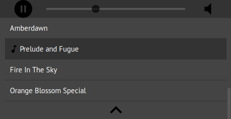

# html5-audio-player

A pure HTML5 and JavaScript audio player.

NOTE: Many features in the devel branch may not be in master yet.

## Features

These are the features that have been implemented so far:

- playlist
- expand/collapse playlist
- play/pause
- peek in time
- volume up/down
- responsive design
- playlist loop none, one, all (via config, not UI)

Lots of features and improvements shall be implemented as time permits.


## Screenshots

Playlist open:



Playlist closed:


## Getting Started ##

First of all, make sure your page has a div/section with and id
of `player-wrapper`.

```html
...
<div id='player-wrapper'><!-- Your player will appear here. --></div>
...
```

Then add the song list to the `init` method:

```javascript
player.init({
    loop: 'none', // 'none', 'one', 'all'. Default: 'none'.
    songs: [
        //{url: 'https://upload.wikimedia.org/wikipedia/en/4/45/ACDC_-_Back_In_Black-sample', name: 'Black in Black'},
        {url: 'songs/one', name: 'Querendo Chorar'},
        {url: 'https://upload.wikimedia.org/wikipedia/en/4/4a/Bach_Prelude_Fugue_BWV_542', name: 'Prelude and Fugue'},
        {url: 'songs/two', name: 'Amberdawn'},
        {url: 'songs/three', name: 'Orange Blossom Special'}
    ]
});
```

The `loop` option works as follows:

- `none`: play up to the last song and stop (don't start over from the beginning
  of the playlist).
- `one`: keep playing the same song forever.
- `all`: after playing the last song, start again from the first item in the
  playlist.


